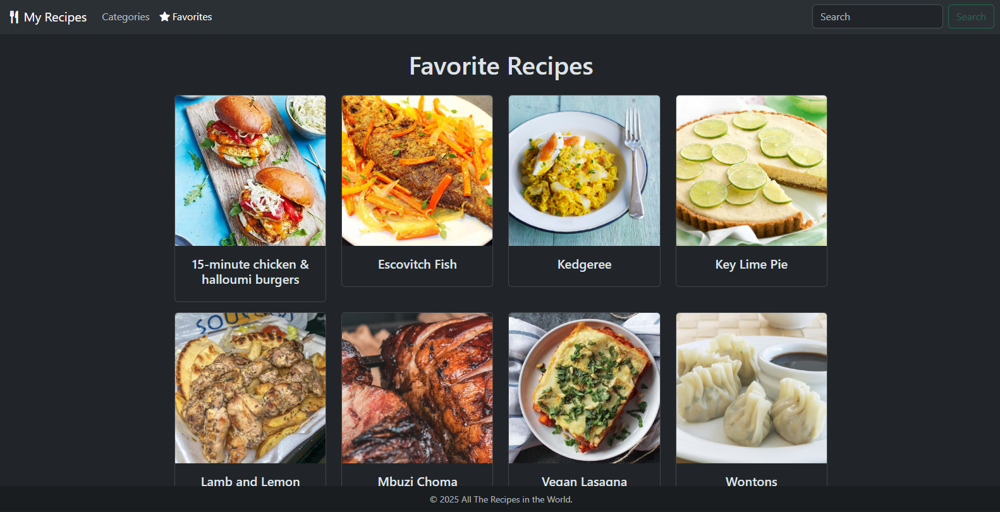

# SBA 10: Recipe Discovery App

[Karl Johnson](https://github.com/hirekarl)  
2025-RTT-30  
<time datetime="2025-08-09">2025-08-09</time>  



## Overview
### Viewer Instructions
1. In the terminal, run:

```bash
cd recipe-discovery-app && npm i && npm run dev
```

2. Navigate to http://localhost:5173/ in the browser.

### Submission Source
Top-level app behavior can be found in [`./recipe-discovery-app/src/App.tsx`](./recipe-discovery-app/src/App.tsx).

### Reflection
Write a short section in your README.md or in a separate REFLECTION.md file detailing:
- The most challenging part of the project for you.
- A brief explanation of a design decision you made (e.g., why you structured a hook a certain way, how you decided to manage a piece of state).

> The most challenging part of the project had to do with trying to implement the loading spinner, to be honest. Ideally, it would show up in the middle of the page, rather than right at the top. With more time, I'd flesh it out. Also, I'm pretty sure the way I have spacing ensures the `Footer` component is always sticky at the bottom of the page, but I'm not 100% sure.
>
> There are many improvements I'd like to make. For one thing, on each `Recipe`, I'd like the "back" button to point to whatever page the user was on last. I know how to implement, but I ran out of time. I also want to give users the ability to add and remove favorites on the `RecipeCard`s themselves, but that would require a new implementation. Another pass at improving the overall UI would be great to get this where I want it. I also want to abstract away each page component into a `Page` component that accepts children; that would de-duplicate a lot of the clutter-y Bootstrap divs I've got going on.
>
> Whenever the user requests a resource that can't be found, they're redirected to a `/not-found` route. I initially thought of rendering a `NotFound` component on each route when resources aren't found, but I found it cleaner to send them to a dedicated route that communicates the "not found." A splat route also redirects users to `/not-found`.
>
> I also chose to implement the `SearchBar` with a button instead of sending debounced requests to the API based on changes in the `<input>`. That could be a cool feature for a v2. The Search button is disabled unless the input has some value, and search strings' spaces are replaced with `+` to properly query the API when more than one word is sent as part of the query.

## Assignment
For this project, you will build a client-side “Recipe Discovery” application. This project will serve as a comprehensive demonstration of your mastery of advanced React concepts. The application will allow users to browse recipes by category, search for specific recipes, view detailed recipe information, and manage a personal list of “favorite” recipes.

You will use a free, public API for recipe data and implement a varietys of hooks, state management patterns, and routing solutions to create a feature-rich, single-page application (SPA).

## Attributions
